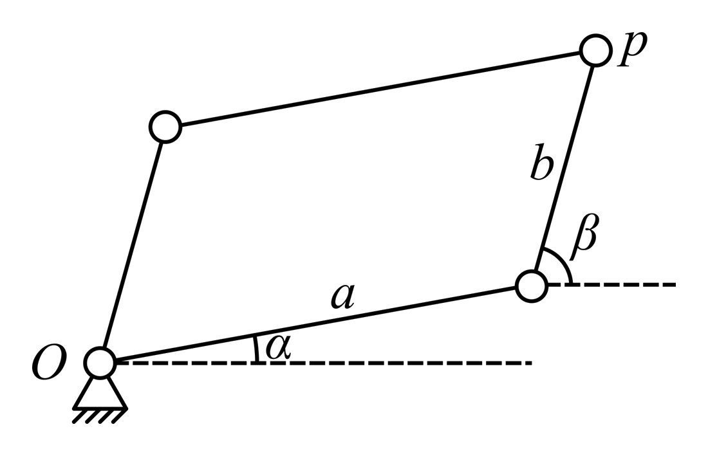

# Kempe Linkages

This is an implementation of [Kempe's universality theorem][kempe]. It processes
a given [algebraic curve][algebraic_curve] and turns it into a linkage
containing a joint that traces the curve.

## Demo

<video src="assets/demo.mp4" controls></video>

## Input

The program takes an algebraic curve as input. An algebraic curve is the zero
set of of polynomial in two variables `x` and `y`. That is, you can combine `x`,
`y` and the real numbers using addition, subtraction and multiplication and when
you set the resulting expression to zero, that [implicitely
defines][implicit_function] a curve. A point lies on that curve exactly when the
expression equals zero after you substitute `x` and `y` with the coordinates of
the point.

In addition to the curve, the program takes a bunch of options that configure
the output.

## Output

The program outputs a simulation of a linkage. The linkage contains a joint, the
_pen_, that traces the algebraic curve. However, the pen is constrained to lie
on a disk around the origin. The radius of the disk is given as one of the input
options.

The simulation of the linkage is visualized as an animated plot that shows the
trace of the pen as well as the movements of the links and the pen. Which links
are shown can be configured using input options.

# How to install

Clone the repository and install the dependencies listed in `requirements.txt`.

# How to use

`main.py` is the entry point of the program. These two lines can be changed to configure the input and output:
```python
linkage = KempeLinkage(radius = 4, pen_start = (0, 3), visible = Visibility.ALL)
linkage.from_curve(x - y, x, y)
```
The first parameter to the `from_curve` method is the expression that is set to
`0`. `radius` is the radius of the disk on which the pen lies. `pen_start` are
the initial coordinates of the pen. `visible` specifies which links should be
shown during the simulation. The possible values are defined in `options.py`.
See [_building the linkage_](#building-the-linkage) for more context.

# How it works

The implementation follows Kempe's description of how to construct a linkage for
a given algebraic curve. The core idea is to construct a parallelogram and
constrain the two angles, that its sides make with the x-axis, in such a way,
that its tip can be used as a pen that traces the given curve. The constraints
are put on the angles by first reformulating the equation of the algebraic curve
in terms of the two angles α and β. Through the combination of basic linkages
called _gadgets_, which correspond to simple mathematical operations, the
reformulated equation is then turned into a linkage constraining the original
parallelogram. The linkage is then simulated to trace the curve.



## Reformulating the equation

The equation for the algebraic curve is given as a polynomial in the two
variables `x` and `y`. To reformulate the equation in terms of α and β,
we first need to express the coordinates of the pen using the two angles:
```
x = r / 2 * cos(α) + (r / 2) * cos(β)
y = r / 2 * sin(α) + (r / 2) * sin(β)
```
Now, we can simply substitute these equations into the one for the algebraic
curve. The result is an equation with `0` on one side and powers of sums of
sines and cosines on the other. Using a range of trigonometric identites, we
can normalize that side to a sum of scaled cosines of linear angles:
```
a * cos(m * α + n * β + γ) + b * cos(...) + ... = 0
```
Here, `a`, `b` and `γ` represent arbitrary real numbers while `m` and `n` are
integers. This normalization is done using `sympy`.

## Gadgets

Kempe defines multiple gadgets to build up to the whole equation:
1. The _contra-parallelogram_ is a quadrilateral with equal opposing sides, with
   one pair of the opposing sides being crossed. It has two pairs of equal
   inscribed angles.
2. The _reversor_ uses two contra-parallelograms to multiply an angle by 2.
3. The _multiplicator_ chains multiple reversors to multiply an angle by an arbitrary positive integer.
4. The _additor_ uses two reversors to add two angles. It can also be used to subtract angles.
5. The _translator_ uses parallelograms to copy an angle from one joint to another.
6. The _Peaucellier-Lipkin_ linkage turns rotational movement into linear movement. It can be used to constrain a joint onto a straight line.
7. A rigid triangle can be used to add a constant angle to an angle.
8. A link of arbitrary length can be constrained to make the same angle with the x-axis as another link.

## Building the linkage

Using these gadgets, we can build a linkage that models the equation, all
from the basis angles α and β. Multiplicators can be used to turn `α` into `m *
α`. Additors can be used to turn that into `m * α + n * β`. A rigid triangle
adds the `γ`. By using a link of length `a`, we can construct
`a * cos(m * α + n * β + γ)` in the `x` coordinate of the joint at the end of
the link. Using translators, we can sum all the `x` coordinates of the
fixed-length links together. Finally, we can use a Peaucellier-Lipkin linkage to
constrain the sum of the `x` coordinates to the `y` axis. Thereby, we set the
sum of the scaled cosines to `0`, achieving our goal of modelling the equation
with a linkage.

## Simulating the linkage

The construction and simulation of the linkage is done using
`python-solvespace`, a Python binding for the CAD tool `solvespace`.
Specifically, we move the joint that is controlled by the angle α and ask
`python-solvespace` to solve for the positions of the other joints, such that
the constraints given to it are fulfilled. Then, we retrieve these positions and
use `matplotlib` to display the links. We also keep track of the position of the
pen over time, so we can also display its trace. Doing this process over and
over again produces an animated plot of the links and the trace, i. e. a
visualization of the simulated linkage.

## Caveats

Two of the gadgets originally defined by Kempe are vulnerable to
_degeneration_. That is, by moving them in specific ways, they lose their
properties. For example, the contra-parallelogram can be manipulated so that its
crossed sides un-cross. This issue can be fixed by adding more constraints to
the gadgets. In the case of the contra-parallelogram, one joint and four links
of specific lengths can be added to prevent un-crossing. The addition of
constraints to the gadgets is called _bracing_.

During testing of common ways to brace the gadgets, it appeared that
`solvespace` has problems with the sometimes over-constrained nature of the
resulting linkages. Therefore, a different strategy is used in the
implementation, that is more in line with `solvespace`'s constraints system.
Specifically, parallelograms are braced by an additional parallelity constraint
on one pair of opposing links and contra-parallelograms are braced by adding
another joint that is constrained to lie on both crossing links. This has led to
fewer, but not zero problems during simulation. Therefore, bracing can be
toggled for both gadgets in the input options.

Similarly to bracing, the implementation also doesn't use Peaucellier-Lipkin
linkages to constrain a joint to the `y` axis, but rather the built-in
`vertical` constraint of `solvespace`. However, this was a gut decision rather
than being based on actual testing (it should decrease the amount of work that
`solvespace` has to do).

# Designing curves

Algebraic curves are not very intuitive. Thus, it would be nice if the
implementation could help the user design them. Some basic tools are already
present in `helpers.py`: `implicitize` takes a
[parametric curve][parametric_function] and produces an implicit one and
`bezier` can produce a [Bézier curve][bezier_curve].

Another approach is to build a complex curve from simpler ones. For example, two
Bézier curves may be concatenated together. Mathematically, this can be
described as the union of the two curves. How this can be achieved is described
in Chapter 7 of
[_Generalizations of Kempe's Universality Theorem_][generalizations_pdf].  As
[SVG][svg] files are largely comprised of concatenations of Bézier curves and
other simple curves, an "SVG import" may be possible.

# Limitations

While the program can _generate_ a linkage for every curve, the _simulation_
sadly fails for a large number of curves. This can manifest in two ways. Either,
only the input joint moves and the rest of the linkage is stationary or the
entire linkage does move, but the pen does not trace the requested curve.
These are some example curves:

| Curve                                                               | Works? |
| ------------------------------------------------------------------- | ------ |
| `x - y`                                                             | ✅      |
| `x ** 2 + y ** 2 - 0.4 ** 2`                                        | ✅      |
| `x ** 2 / 3 - y`                                                    | ❌      |
| `3 * x ** 3 * y - 5 * y ** 2`                                       | ❌      |
| `implicitize(*bezier(t, (0, 1), (-1, 3), (2, 2), (3, 0)), t, x, y)` | ❌      |

The exact reason for this is unclear. As the problematic curves are the ones
with the higher order polynomials, it may be due to inaccuracies/limitations of
solvespace, i. e. it may not be able to reliably handle very large linkages.

## Debugging

Another reason may be a problem in the implementation. If this is the case, it
may be difficult to find the problem, since "debugging" the produced linkages is
hard, when the linkage is large. This is because `python_solvespace` only
outputs whether the solve attempt was successful as opposed to why that is the
case. Interactively debugging the linkage, by dragging joints around, is not
possible at the moment, since `python_solvespace` only provides APIs for
creation and (headless) simulation of the linkage, not for opening a user
interface or exporting to a file (which would allow opening that file with a
standalone `solvespace` installation).

To alleviate this problem, work has begun on implementing a custom exporter for
the `.slvs` file format, that `solvespace` uses. It can be found in
`slvs_writer.py`. However, in the current state, it is unusable, as it outputs
files that cause `solvespace` to crash (the results of some debugging using
`gdb` suggest that the problem lies in the generation of the handles).

# Future Work

- Make more complicated algebraic curves feasible, see [limitations](#limitations).
- Finish the .slvs exporter, see [debugging](#debugging).
- Incorporate generalizations, see [designing curves](#designing-curves).

# References

[Kempe, Alfred Bray. On a General Method of describing Plane Curves of the nth
degree by Linkwork. _Proceedings of The London Mathematical Society_ (1875):
213-216.][kempe] ([PDF][kempe_pdf])

[Saxena, Anupam. Kempe’s Linkages and the Universality Theorem. _Reson_ 16
(2011): 220-237.][kempe_as] ([PDF][kempe_as_pdf])

[Abbott, Timothy Good. Generalizations of Kempe's universality
theorem.][generalizations] ([PDF][generalizations_pdf])

[algebraic_curve]: https://en.wikipedia.org/wiki/Algebraic_curve#In_Euclidean_geometry
[implicit_function]: https://en.wikipedia.org/wiki/Implicit_function
[parametric_function]: https://en.wikipedia.org/wiki/Parametric_equation
[bezier_curve]: https://en.wikipedia.org/wiki/B%C3%A9zier_curve
[svg]: https://en.wikipedia.org/wiki/SVG

[kempe]: https://doi.org/10.1112/plms/s1-7.1.213
[kempe_pdf]: https://zenodo.org/records/1447760/files/article.pdf
[kempe_as]: https://doi.org/10.1007/s12045-011-0028-x
[kempe_as_pdf]: https://web.archive.org/web/20161207161112/http://home.iitk.ac.in/~anupams/me352a_2015_course_folder/Kempe_AS.pdf
[generalizations]: http://hdl.handle.net/1721.1/44375
[generalizations_pdf]: http://web.mit.edu/tabbott/www/papers/mthesis.pdf
